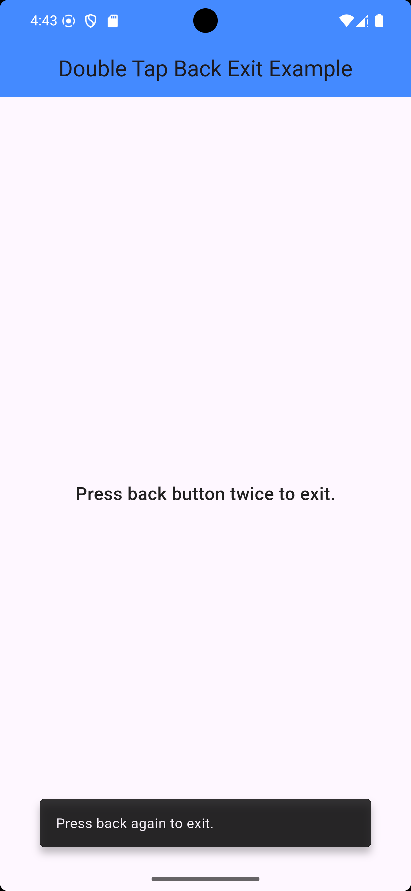
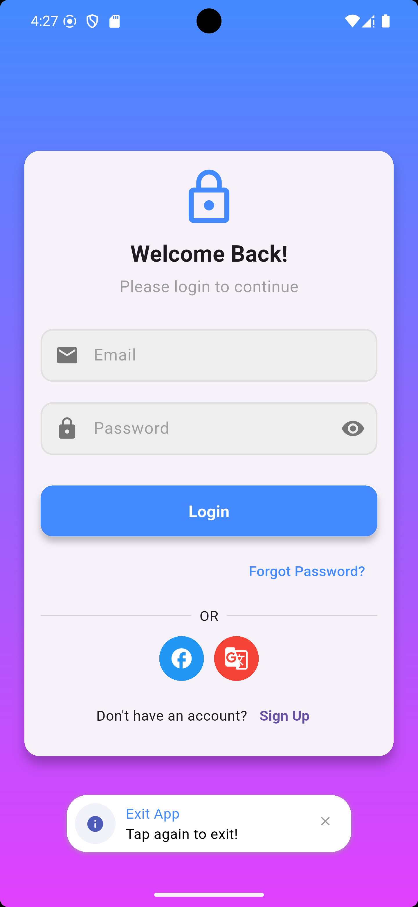

# DoubleTapBackExit

A Flutter utility package that prevents accidental app exits by requiring a double-tap or swipe gesture to exit. It allows customizable exit messages and integrates with custom toast notifications.

## Features

- Detects **back button press** and **swipe gestures** for exit.
- Allows **custom exit messages** for tap and swipe actions.
- Supports **custom toast/snackbar notifications**.
- Optional **swipe-to-exit** toggle.
- Uses **PopScope** for Android predictive back gestures (Flutter 3.12+ compatible).

## Installation

Add the following to your **pubspec.yaml**:

```yaml
dependencies:
  double_tap_back_exit: latest_version
```

## Usage

Wrap your app's **home screen** with `DoubleTapBackExit`:

```dart
import 'package:double_tap_back_exit/double_tap_back_exit.dart';
import 'package:flutter/material.dart';

void main() {
  runApp(MyApp());
}

class MyApp extends StatelessWidget {
  @override
  Widget build(BuildContext context) {
    return MaterialApp(
      home: DoubleTapBackExit(
        duration: Duration(seconds: 3),
        tapExitMessage: "Tap again to close the app!",
        swipeExitMessage: "Swipe again to exit!",
        enableSwipeBack: true,
        enableTapBack: true,
        showToast: (context) => _showCustomToast(context),
        child: HomeScreen(),
      ),
    );
  }

  void _showCustomToast(BuildContext context) {
    ScaffoldMessenger.of(context).showSnackBar(
      SnackBar(
        content: Text("Tap again to exit"),
        duration: Duration(seconds: 2),
      ),
    );
  }
}
```

## Properties

| Property           | Type                      | Default                      | Description                                                            |
| ------------------ | ------------------------- | ---------------------------- | ---------------------------------------------------------------------- |
| `child`            | `Widget`                  | **Required**                 | The main widget wrapped inside `DoubleTapBackExit` (e.g., `HomeScreen`).  |
| `duration`         | `Duration`                | `Duration(seconds: 2)`       | Time interval for double-tap/swipe detection.                          |
| `showToast`        | `Function(BuildContext)?` | `null`                       | Custom toast/snackbar function. If `null`, a default Snackbar is used. |
| `enableSwipeBack`  | `bool`                    | `true`                       | Enables/disables swipe-to-exit.                                        |
| `enableTapBack`    | `bool`                    | `true`                       | Enables/disables tap-to-exit.                                          |
| `tapExitMessage`   | `String?`                 | `"Press back again to exit"` | Custom message for tap exit.                                           |
| `swipeExitMessage` | `String?`                 | `"Swipe again to exit"`      | Custom message for swipe exit.                                         |

### Important Note:
If you use a custom showToast function, like this:

```dart
showToast: (context) => _showCustomToast(context),

```
Then, you do not need to pass `tapExitMessage` or `swipeExitMessage`, since your custom function will handle the message display

## Demo

Here’s how DoubleTapBackExit works in action:

<div align="center"> <div style="display: flex; flex-direction: column; align-items: center; justify-content: center;"> <div style="margin-bottom: 10px;"> <h4>Custom Snackbar</h4>  </div> <div> <h4>Custom Toast</h4>  </div> </div> </div>

## Contributing to DoubleTapBackExit

We welcome contributions to **DoubleTapBackExit**! If you'd like to contribute, please follow the steps below:

### **How to Contribute**
1. **Fork the Repository**
   - Start by forking the repository on GitHub [repo-link](https://github.com/Marcocholla01/double_tap_back_exit) to your own account.
   
2. **Create a New Branch**
   - Once you’ve forked the repository, create a new branch where you’ll implement your feature or fix:
     ```bash
     git checkout -b feature-name
     ```

3. **Make Changes**
   - Implement your changes or add the new feature. Ensure that your code follows the existing coding conventions.
   
4. **Commit Your Changes**
   - After making changes, commit them to your branch with a clear message explaining your modifications:
     ```bash
     git commit -am 'Add new feature'
     ```

5. **Push Your Branch**
   - Push your changes to your forked repository:
     ```bash
     git push origin feature-name
     ```

6. **Open a Pull Request**
   - Once your changes are pushed, open a pull request (PR) from your branch to the main repository. Please provide a detailed description of the changes and the motivation behind them.


### **Code Standards**
- Ensure your code follows existing conventions and standards (e.g., indentation, function naming, etc.).
- Add relevant documentation and comments to your code to make it more understandable.


### **Why DoubleTapBackExit?**
The **DoubleTapBackExit** package was created to enhance app usability and prevent accidental app exits. Many mobile apps experience user frustration when the back button or swipe gestures lead to unintended exits. This package ensures that users are intentionally exiting the app by requiring a double-tap or swipe gesture.

This package is especially useful for applications where preventing accidental exits is crucial, such as games, messaging apps, or apps that handle important tasks.


### **Encouragement to Star the Repo**
If you find **DoubleTapBackExit** useful or have benefited from it in your projects, please consider giving the repository a ⭐️! Your support helps improve the visibility of the project and encourages more developers to contribute, which in turn benefits the entire community.


### **We Appreciate Your Contributions!**
Whether it's fixing a bug, adding a new feature, or improving the documentation, every contribution is valuable to the success of this project. Thank you for being a part of the **DoubleTapBackExit** community!


## License

MIT License. See `LICENSE` for details.

---

### 🚀 Enhance User Experience

Use `DoubleTapBackExit` to **prevent accidental exits** and improve app usability!

